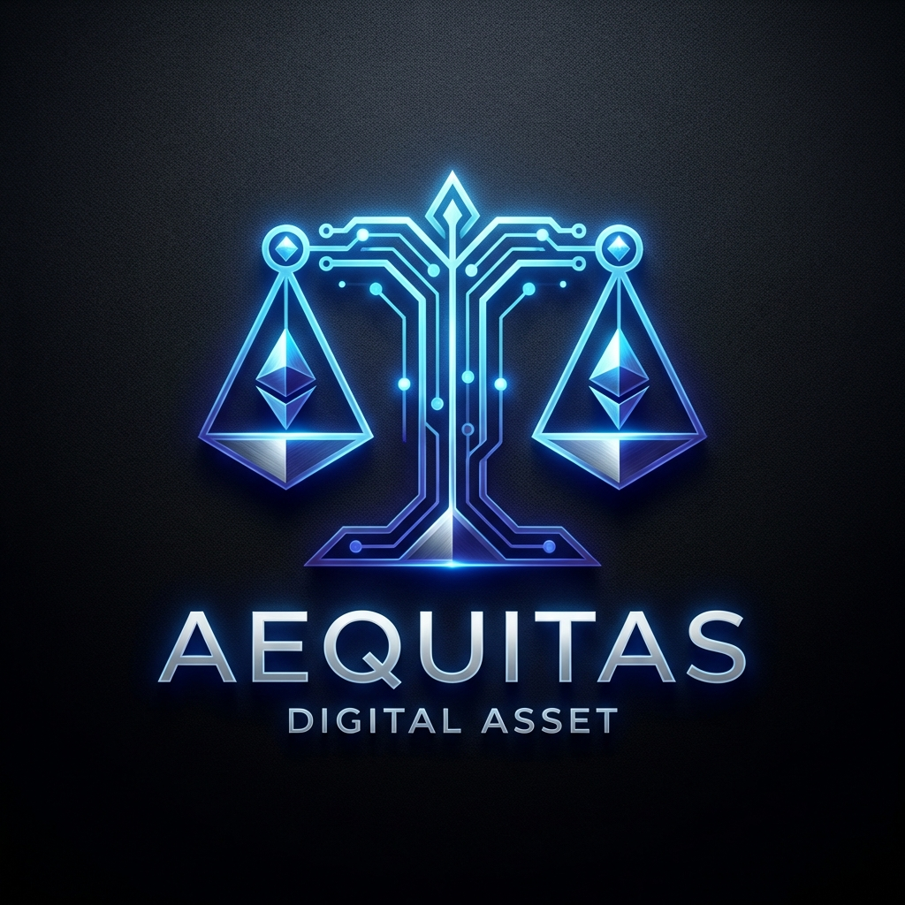
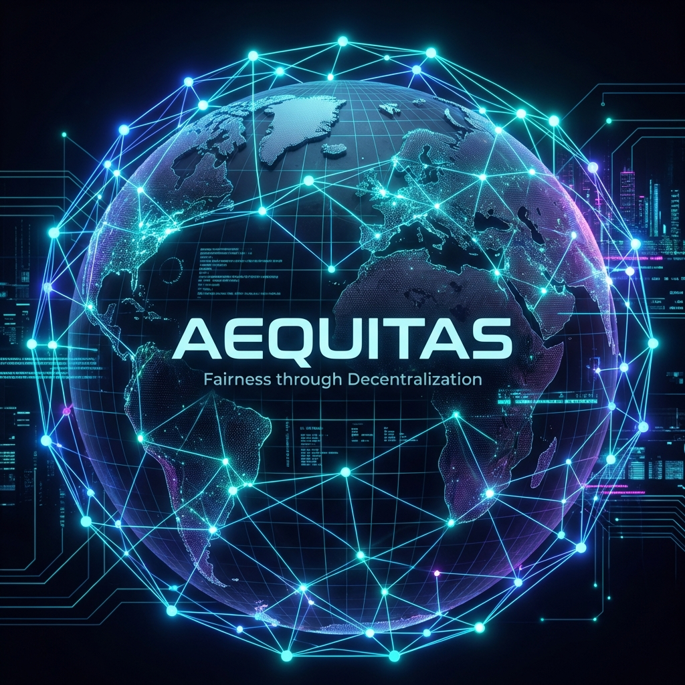

#  AEQUITAS (AEQ)

<p align="center">
  
</p>

<p align="center">
  <b>"Fairness through Decentralization"</b><br>
  A Next-Generation, GPU-Optimized, Fair-Launch Cryptocurrency.
</p>

<p align="center">
  
  
  
  
</p>

---

## 💎 What is Aequitas?

**Aequitas** (Latin for "Equity") is a decentralized blockchain project born from a simple observation: modern mining is dominated by massive centralized ASIC farms. We are taking the power back and giving it to individuals.

### 🚀 Key Pillars:
- ⚖️ **Fair Launch**: 0% Pre-mine. 0% Team allocation. 100% of the supply is earned through work.
- ⚡ **GPU Optimized**: Our AequiHash algorithm is specifically designed to run on consumer hardware (NVIDIA RTX 30/40 series).
- ⚙️ **libp2p P2P Stack**: Built on the world's most advanced peer-to-peer networking stack for ultimate resilience.
- 🌍 **Global DHT Discovery**: Automatic peer discovery via Kademlia DHT—no central bootstrap servers required.

---

## 📊 Technical Specifications

| Parameter | Value |
|-----------|--------|
| **Algorithm** | AequiHash (GPU-friendly) |
| **Block Time** | 30 Seconds |
| **Initial Reward** | 50 AEQ |
| **Halving Interval** | 2,100,000 Blocs (~2 years) |
| **Max Supply** | 210,000,000 AEQ |
| **Network Port** | 23420 (P2P), 8080 (RPC) |

---

## 🛠️ Quick Start Guide

### 1. Installation
```bash
git clone https://github.com/moinecalixte-cyber/aequitas.git
cd aequitas
cargo build --release
```

### 2. Run a Full Node
Join the decentralized mesh.
```bash
./target/release/aequitas-node run
```

### 3. Start Mining
Put your GPU to work and secure the network.
```bash
# Add your address to miner.toml
./target/release/aequitas-miner mine
```

---

## 🗺️ Roadmap (2026)

- [x] **Phase 1**: Genesis Block & Core Engine.
- [x] **Phase 2**: Global P2P Networking (libp2p + DHT).
- [x] **Phase 3**: Web Dashboard & Real-time Tracking.
- [ ] **Phase 4**: Smart Contract Layer (AequiVM).
- [ ] **Phase 5**: Mobile Wallet Integration.
- [ ] **Phase 6**: Decentralized Exchange (DEX) Listing.

---

## 🤝 Contributing & Community

We are looking for **developers, cryptographers, and evangelists**. 

1. **GitHub**: Star the repo, open an Issue, or submit a PR!
2. **Discord**: [Join our developer community](https://discord.gg/aequitas) *(Coming soon)*
3. **X (Twitter)**: Follow [@AequitasCoin](https://x.com/AequitasCoin) *(Coming soon)*

---

## 📜 License
This project is licensed under the **MIT License** - see the [LICENSE](LICENSE) file for details.

<p align="center">
  <i>"The future of finance is equitable. The future is Aequitas."</i>
</p>
